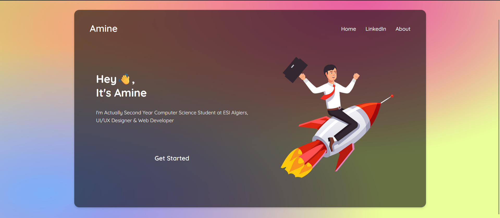

Great! Based on the screenshot of your project, here is an updated README file that fits your HTML and CSS project showcasing your personal portfolio:

---

# My Portfolio

A personal portfolio website showcasing the work, skills, and contact information of Amine, a second-year computer science student at ESI Algiers, specializing in UI/UX design and web development.

## Table of Contents

- [Introduction](#introduction)
- [Features](#features)
- [Usage](#usage)
- [Screenshots](#screenshots)
- [Contact](#contact)

## Introduction

This is a personal portfolio website for Amine, a second-year computer science student at ESI Algiers. The website is designed to showcase my skills in UI/UX design and web development, and to provide a platform for potential employers and collaborators to get in touch.

## Features

- Responsive design for optimal viewing on any device
- Clean and modern UI/UX
- Information about my education and skills
- Links to social media profiles (LinkedIn)
- Contact form for direct communication

## Usage

Open the `index.html` file in your web browser to explore the portfolio. The navigation links at the top of the page provide easy access to different sections of the site, including home, LinkedIn, and about.

## Screenshots

Here's a screenshot of the home page of the portfolio website:

## Contact

If you have any questions or would like to get in touch, please contact me at:

- **Email**: nm_bekoul@esi.dz
- **GitHub**: https://github.com/BekoulAmine

---

Feel free to adjust the content as needed to better match your specific details and preferences.
